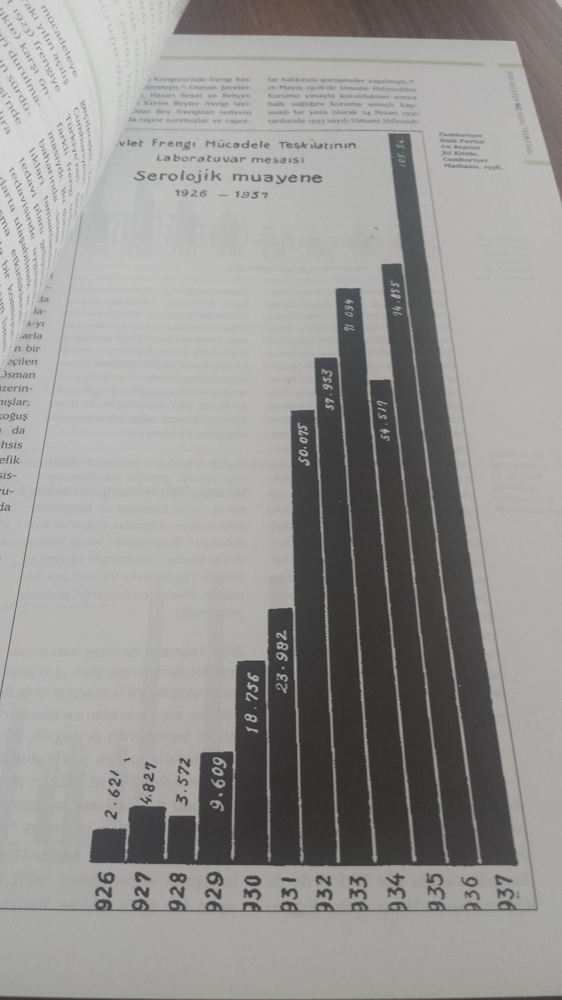
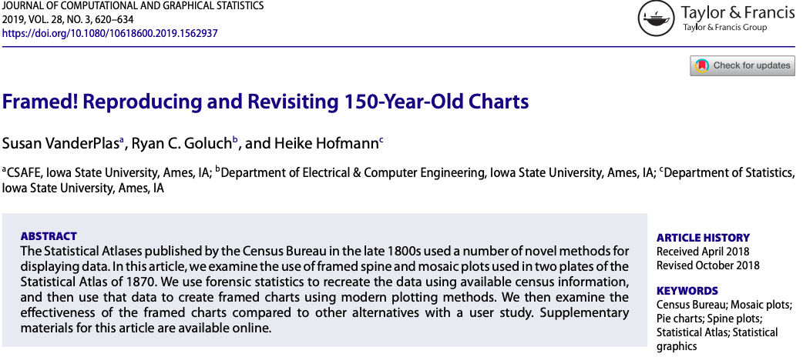
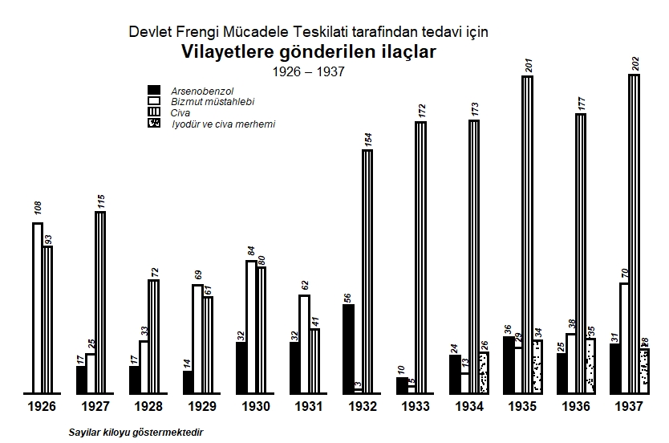

```{r xaringan-scribble, echo=FALSE}
xaringanExtra::use_scribble(pen_color="#179a9e") #activate for the pencil
xaringanExtra::use_panelset() #panel set
```

class: title-slide, left, top
background-image: url(img/istanbul3.jpeg)
background-position: 10% 1%
background-size: cover


#  `r rmarkdown::metadata$title`
## `r rmarkdown::metadata$author`
## `r rmarkdown::metadata$institute`
### `r rmarkdown::metadata$date`

---
class: left, top
background-image: url(img/jsm.png)
background-position: 1% 99%
background-size: 20%


## Outline

* Motivation and aim
* Historical bar graphic examples
* Conclusion


---
```{css echo=FALSE}
.pull-left {
  float: left;
  width: 50%;
}

.pull-right {
  float: right;
  width: 50%;
}
```
## Motivation

.pull-left[
- In August 2018, a local history journal named "**Social History**" published an issue on "**Pandemics in the History**".
- The issue involves **articles on pandemics** such as  malaria, trachoma, syphilis, and tuberculosis.
- The **content of articles** were accompanied by rich **historical photographs** and **visualizations**.
]

.pull-right[
```{r, echo=F, out.width="500px", out.height="500px"}
knitr::include_graphics("img/front_page.jpeg")
```
]

---
<style>
p.caption {
  font-size: 0.6em;
  font-weight: bold;
}
</style>

## Motivating Article

- The article entitled "**Fight against syphilis that forgot to embrace in
the era of early Republic**" by  <span style="color:#179a9e"> Malkoc (2018)</span> took our attention.
- This article involves aesthetically attractive **statistical column bar graphics**, which were **published in 1938**, giving official statistics related to syphilis occurred in the country between **1923** and **1937**.


---
```{css echo=FALSE}
.pull-left {
  float: left;
  width: 50%;
}

.pull-right {
  float: right;
  width: 50%;
}
```
## Motivating Examples

```{r, echo=F, fig.show ="hold", out.width="310px", out.height="450px"}



```


---
## Motivation Continu'ed

- In April 2019, <span style="color:#179a9e">VanderPlas et al. (2019)</span> raised the topic of **revisiting, reinterpreting, and reproducing
some novel charts, from 1870 Statistical Atlas, with modern technology**. <br> <br>


```{r, echo=F, out.width="900px", out.height="300px"}

```


---
## Motivation Continu'ed

- In April 2019, we reached out the author of the history article to ask for the main source of graphics.
- The **author**, who is a **historian**, provided us a **government report** published in **1938** as the main source of graphics.
- This government report:
   - provides **official statistics** on multiple **epidemics** such as smallpox, trachoma, and malaria occurred between the years 1923 and 1937 in the country. 
   - summarizes the official statistics especially on **workload of hospitals** and then on **vaccine administration** in the country, and     
   - uses several (around 40) **black and white** print column bar graphics, which were drawn by hand with the help of a ruler, for **informing the society with a low literacy skill** during that period.
- The government report is also **publicly available** at https://acikerisim.tbmm.gov.tr/handle/11543/553.

---
## Aim 
- In this study, we would like to investigate:
   - **How graphical elements** of these historical graphics such as fill-in colors, data values, titles, axis lines, axis tick marks, tick mark labels, and legend colors are **designed** and 
   - Whether it is possible to **reproduce** the identical of them in a digital platform in our era via **R ggplot2** (<span style="color:#179a9e">Wickham, 2016</span>).
- A side note: We are neither expert on data visualization, or on infectious disease modeling.

---
## Column Bar Graphics used in this study

- Bar graph with a single data series
- Grouped overlapped bar graphs with two data series
- Grouped side-by-side bar graphs with multiple data series
- Paired bar graphs with two data series

---
class: center, middle

## Column bar graph with a single data series
---
.panelset[
.panel[.panel-name[Original Graph]

```{r, echo=F,  fig.align="center", fig.margin = TRUE, fig.cap="The number of smallpox vaccine administered <br> in various regions of the country, 1925-1937.", out.width="400px", out.height="490px"}

```

]

.panel[.panel-name[Information Design]

.pull-left[
```{r, echo=F,  fig.align="center", fig.margin = TRUE, fig.cap="The number of smallpox vaccine administered <br> in various regions of the country, 1925-1937.", out.width="400px", out.height="490px"}

```
]

.pull-right[
- There is **no** information related to **vertical axis**. 
- The amount of vaccines per year are available as **data values** within the column bars. 
- The **height of the bars** is directly proportional to the **data values** they represent. 
- The data values are **placed vertically** inside the columns.
- The horizontal axis refers to the years **without having an axis title**. 
- The horizontal axis **tick mark labels** are displayed **vertically**.
- The **background color** of the figure is **white**. 
- The **column bars** are filled in **black** color whereas the **data values** are colored in **white** for contrast. 
- **Computational Challenge**: Main figure title consists of lines in different font types/size.
]
]


.panel[.panel-name[R Code]

.scrollable[

```{r, echo=F, eval=F}
/*-- X is continuous first, then it has be a factor
for geom_bar, then we need coordinates for annotation. Interesting
they are character vectors now. --*/
```

```{r, eval=F, echo=T}
number_vaccine <- c(854750, 1356896, 1418362, 1280931, 1394799, 1637811, 1452892,
                    1418992, 1686364, 1908213, 1761660, 2888906, 1672048)/1000
year <- rep(seq(1925,1937),1)
data_fig <- data.frame("x" = year, "y" = number_vaccine)

y_label <- c("854.750", "1.356.896", "1.418.362", "1.280.931","1.394.799", "1.637.811", "1.452.892", 
             "1.418.992", "1.686.364", "1.908.213", "1.761.660", "2.888.906", "1.672.048")
xcor <- rep(paste(c(seq(1925,1937)), sep=""), 1)
ycor <- number_vaccine + 100

ggplot2::ggplot(data=data_fig, aes(x=factor(year), y=number_vaccine)) +
  geom_bar(stat="identity", fill="black") + #<<
  scale_x_discrete(expand = c(0,0)) +   #stars bars from origin
  theme_classic() + #background format
  scale_y_continuous(expand = c(0,0)) + #moves bars to the horizontal axis 
  annotate("text", x = xcor, y = ycor, label = y_label,  #data values
                 color = "white", fontface = "bold.italic", size=2, angle=90, hjust=1.9, vjust=0.2) + 
  #main figure title with different characteristics
  annotate("text", x = "1927", y = 2818.362, label = "Yurdun muhtelif bolgelerinde", fontface = "bold.italic", size=3, hjust=0.2, vjust=-1.0)+ 
  annotate("text", x = "1928", y = 2700.362, label = "1925-1937", fontface = "bold.italic", size=3, hjust=-0.1, vjust=-1.0)+
  annotate("text", x = "1927", y = 2600.362, label = "Seneleri zarfinda yapilan", fontface = "bold.italic", size=3, hjust=0.1, vjust=-1.0)+
  annotate("text", x = "1927", y = 2450.362, label = "Cicek asisi", fontface = "bold", size=4, hjust=-0.3, vjust=-1.0) +
  #other formats
  theme(axis.title = element_blank(), 
        axis.line.x = element_line(colour = "black", size = 1.0),  axis.line.y = element_blank(),
        axis.ticks = element_blank(), 
        axis.text.x = element_text(color = "black", size = 8, face = "bold", hjust = 0.45, vjust = 0.5, angle = 89.99), 
        axis.text.y = element_blank(), 
        plot.margin = margin(0.5, 0.5, 0.5, 0.5, "cm"))
       

```

]
]

.panel[.panel-name[Reproduced Graph]
```{r, echo=F,  fig.align="center", fig.margin = TRUE, fig.cap="The number of smallpox vaccine administered <br> in various regions of the country, 1925-1937.", out.width="350px",  out.height="500px"}

```
]
]

---
class: center, middle

## Grouped overlapped column bar graphs with two data series
---

.panelset[
.panel[.panel-name[Original Graph]

```{r, echo=F,  fig.align="center", fig.margin = TRUE, fig.cap="The service of hospitals and dispensaries within Trachoma Struggle Organization, 1925-1937. <br> (▪ The number of inpatient treatments, ▫️ The number of surgeries performed)", out.width="400px", out.height="490px"}

```


]


.panel[.panel-name[Information Design]

.pull-left[
```{r, echo=F,  fig.align="center", fig.margin = TRUE, fig.cap="The service of hospitals and dispensaries within Trachoma Struggle Organization, 1925-1937. <br> (▪ The number of inpatient treatments, ▫️ The number of surgeries performed)", out.width="400px", out.height="490px"}

```
]

.pull-right[
- There is **no** information related to **vertical axis**.
- There is **no labels** for the **horizontal axis tick marks** now. 
- The columns of both groups are **totally overlapped**.
- **Perception Challenge**: Stacked bar charts are not suitable for the public who has a low level of literacy. 
- The **disparity** between groups is manipulated through assigning a **strong color** (black color), to the number of inpatient treatments, and a **recessive color** (white color), to the number of surgeries performed. 
- The **legend keys** are ordered according to **color**.

]

]

.panel[.panel-name[R Code]
.scrollable[

```{r, eval=F, echo=T}
Inpatient <- c(64,298,581,312,312,425,1257,1644,2073,2215,2215,2332,2579)
Outpatient <- c(99,642,909,646,702,2694,2418,4287,4212,4318,3719,4034,4916)
Time <- rep(seq(1925,1937),2)
Value <- c(Inpatient,Outpatient)  
Group <- factor(c(rep(c("Yatirilarak tedavi sayisi", "Yapilan ameliyat       \" "), each=length(Inpatient))),
                levels=c("Yatirilarak tedavi sayisi", "Yapilan ameliyat       \" "))
data <- data.frame("x"=Time, "y"=Value, "grp"=Group) 

xcor <- rep(c(seq(1925,1937)),2)
ycor <- Value + 90

y.label1 <- c("64","298","581","312","312","425"," 1.257"," 1.644","  2.073","  2.215","  2.215","  2.332","  2.579",
              "       \u201399","642","909","646","702","  2.694","  2.418","","","","","","")
y.label2 <- c("","","","","","","","","","","","","","","","","","","","","4.287","4.212","4.318","3.719","4.034","4.916")

ggplot2::ggplot(data=data, aes(x=Time, y=Value, fill=Group, color=Group, alpha=Group)) +
  #position="identity" gives 100% overlapping structure.
  geom_bar(stat="identity", position ="identity", color="black", size=1.25, width=0.65) + #<<
  scale_y_continuous(expand = c(0,0)) +
  scale_fill_manual(values=c("black","white")) + #assign group colors manually #<<
  scale_alpha_manual(values=c(1, 0)) + #adjust the opacity, required. #<<
  theme_classic()+ #background format
  annotate("text", x = xcor, y = ycor, label = y.label1, #data values for inpatient group, inside the bar
           color = "black", size=4, fontface = "bold.italic", angle = 90, hjust = 0.4) +
  annotate("text", x = xcor, y = ycor, label = y.label2, #data values for surgery group, at the top of the bar
           color = "black", size=4, fontface = "bold.italic", angle = 90, hjust = 1.8) +  
  #main figure title with different characteristics. labs and annotate is used.
  labs(title = "TRAHOM MUCADELE TESKILATI",
       subtitle = "Hastane ve Dispanserler Faaliyeti\n") +
  annotate("text", x=1927.5,  y=4210, label="1925 \u2013 1937", fontface="bold", size=5.5) + 
  #plot title format
  theme(plot.title=element_text(color = "black", size = 12, face = "bold", family="sans", vjust=-15, hjust=0.1),
        plot.subtitle=element_text(color = "black", size = 15, face = "bold.italic", family="sans", vjust=-15, hjust=0.1)) + 
  #general format
  theme(axis.title = element_blank(), 
        axis.line.x = element_line(color = "black", size = 1.2), axis.line.y = element_blank(), 
        axis.ticks = element_blank(), 
        axis.text = element_blank(),
        plot.margin = margin(0.5, 0.5, 0.5, 0.5, "cm")) +
  #legend format
  theme(legend.title=element_blank(), legend.text = element_text(size=12, face = "bold.italic"), #<<
        legend.key = element_rect(size = 5, fill = "white", colour = "white"), #<<
        legend.position=c(0,0.82), legend.justification=c(0,1), legend.direction='vertical', #<<
        legend.spacing.x = unit(0.15,"cm")) + #<<
  guides(fill=guide_legend(keywidth=0.78,keyheight=0.30,default.unit="inch")) + #<<
  annotate("rect", xmin=1924.8, xmax=1925.2, ymin = 90, ymax=105, color="white", fill="white")
```
]
]

.panel[.panel-name[Reproduced Graph]
```{r, echo=F,  fig.align="center", fig.margin = TRUE, fig.cap="The service of hospitals and dispensaries within Trachoma Struggle Organization, 1925-1937. <br> (▪ The number of inpatient treatments, ▫️ The number of surgeries performed))", out.width="400px", out.height="490px"}

```
]
]

---
.panelset[
.panel[.panel-name[Original Graph]
```{r, echo=F,  fig.align="center", fig.margin = TRUE, fig.cap="The workload of private hospitals, 1926-1937. <br> (▪ The number of inpatient treatments, ▫️ The number of outpatient treatments)", out.width="500px", out.height="490px"}

```

]


.panel[.panel-name[Information Design]

.pull-left[
```{r, echo=F,  fig.align="center", fig.margin = TRUE, fig.cap="The workload of private hospitals, 1926-1937. <br> (▪ The number of inpatient treatments, ▫️ The number of outpatient treatments)", out.width="500px", out.height="490px"}

```
]

.pull-right[
- **Except the first year**, the columns of the number of inpatient treatments (black) are **shorter** than the columns of the number of outpatient treatments (white). 
- **Computational Challenge**: R ggplot2 cannot handle it.
- The columns, which are positioned in the **front**, are **shifted to the left**, resulting in around $70\%$ overlapping. 
- Due their **front position and stronger color**, the number of inpatient treatments (black) **take the attention** of the reader. 
]

]

.panel[.panel-name[R Code]
.scrollable[

```{r, eval=F, echo=T}
Inpatient <- c(17700,22661,24851,37117,54065,50562,54318,57570,62301,63468,70025,74033)
Outpatient <- c(NA,45333,50286,116765,164381,218366,264382,299398,351547,374318,308366,357450)
Time <- rep(seq(1926,1937),2)
Value <- c(Inpatient,Outpatient)  
Group <- factor(c(rep(c("Yatakda tedavi sayisi", "Ayakta          \"       \" "), each=length(Inpatient))),
                levels=c("Yatakda tedavi sayisi", "Ayakta          \"       \" "))
data <- data.frame("x"=Time, "y"=Value, "grp"=Group) 
xcor <- rep(seq(1926,1937),2)
ycor <- Value + 100
y.label1 <- c("17.700","","","37.117","54.065","50.562","54.318","57.570","62.301","63.468","70.025","74.033",
              "16.009","45.333","50.286","116.765","164.381","218.366","264.382","299.398","351.547","374.318","308.366","357.450")
y.label2 <- c("","22.661","24.851","","","","","","","","","","","","","","","","","","","","","")


ggplot2::ggplot(data=data,aes(x=Time, y=Value, fill=Group, color=Group, alpha=Group)) +
  geom_bar(stat="identity", position = position_dodge(width = 0.3), color="black", size=1.35, width=1.5) +  #position #<< 
  scale_x_continuous(breaks=c(1926,1927,1928,1929,1930,1931,1932,1933,1934,1935,1936,1937)) + 
  scale_y_continuous(expand = c(0,0))+
  scale_fill_manual(values=c("black","white")) + #assign colors to the groups
  scale_alpha_manual(values=c(1, 0)) + #adjust the opacity, required.
  theme_classic() + #background format
  annotate("text", x = xcor, y = ycor, label = y.label1, #data values for inpatient group
           color = "black", fontface = "bold.italic", angle = 90, hjust = -0.1, size=4) +
  annotate("text", x = xcor, y = ycor, label = y.label2, #data values for outpatient group
           color = "black", fontface = "bold.italic", angle = 0, hjust = 0.4, vjust= -0.5 , size=3.5) + 
  annotate("text", x = 1926, y = 16009, label = "16.009", size = 4, fontface = "bold.italic", 
           angle = 90, vjust = -2.5, hjust = 0) +
#integrate first white box manually   #<< 
  annotate("rect", xmin = 1925.5, xmax = 1926.2, ymin = 0, ymax = 14000, color = "black", fill = "white", size = 1.35) +  #<< 
  #main title and its format
  ggtitle("HUSUSI IDARELERE AIT HASTANELER MESAISI \n 1926 \u2013 1937") +
  theme(plot.title=element_text(color = "black", size = 14, family="sans", hjust = 0.4),
        plot.subtitle=element_text(size= 14, family="sans", hjust = 0.45)) +
  #general format
  theme(axis.title = element_blank(), 
        axis.line.x = element_line(color = "black", size = 1.2), axis.line.y = element_blank(), 
        axis.ticks = element_blank(), 
        axis.text.x = element_text(color = "black", size = 14, face = "bold"), axis.text.y = element_blank(), 
        plot.margin = margin(0.9, 0.9, 0.9, 0.9, "cm")) +
  #legend format
  theme(legend.title=element_blank(),legend.text = element_text(size=12, face = "bold.italic"),
        legend.key = element_rect(size = 5, fill = "white", colour = "white"),
        legend.position=c(0,1), legend.justification=c(0,1), legend.direction='vertical',
        legend.spacing.x = unit(0.15,"cm")) +
  guides(fill=guide_legend(keywidth=0.78,keyheight=0.30,default.unit="inch")) +
  coord_cartesian(clip = 'off')

```
]
]

.panel[.panel-name[Reproduced Graph]
```{r, echo=F,  fig.align="center", fig.margin = TRUE, fig.cap="The workload of private hospitals, 1924-1937. <br> (▪ The number of inpatient treatments, ▫️ The number of outpatient treatments)", out.width="500px", out.height="490px"}
knitr::include_graphics("img/hist_graph/Hususirep.png")
```
]
]

---
class: center, middle

## Grouped side-by-side column bar graphs with multiple data series
---
.panelset[
.panel[.panel-name[Original Graph]
```{r, echo=F,  fig.align="center", fig.margin = TRUE, fig.cap="The laboratory workload of Malaria struggle, 1925-1937. <br> (▫️ The number of blood tests, ▪️ The number of diagnoses) ", out.width="500px", out.height="490px"}
knitr::include_graphics("img/hist_graph/Sitmaoriginal.jpg")
```

]

.panel[.panel-name[Information Design]

.pull-left[
```{r, echo=F,  fig.align="center", fig.margin = TRUE, fig.cap="The laboratory workload of Malaria struggle, 1925-1937. <br> (▫️ The number of blood tests, ▪️ The number of diagnoses) ", out.width="500px", out.height="490px"}
knitr::include_graphics("img/hist_graph/Sitmaoriginal.jpg")
```
]

.pull-right[
- The **paired columns** for the same year are now placed **side-by-side**.
- The number of blood tests (white)  are **placing ahead** of the number of diagnoses (black), which enables us to compare how many blood tests are resulted in a positive Malaria diagnosis.
- Although the number of diagnoses is smaller, **coloring it in black** increased its importance. 
- **Vertically placing** the horizontal axis tick mark labels in black color makes an illusion and increases the **dominance** of the number of diagnoses (in black color) in the graphic. 
- The legend key are ordered according to the **order in the color group**.
]

]

.panel[.panel-name[R Code]
.scrollable[

```{r, eval=F, echo=T}
Time <- rep(seq(1925,1937),2)
Treatment <- c(16579,148264,212568,243296,354455,370073,530595,557081,547332,570575,594530,654668,734041)
Diagnosis <- c(1434,14791,10190,9928,36186,45653,61241,72500,50609,48744,40842,62466,69850)
Value <- c(Treatment,Diagnosis)
Group <- factor(c(rep(c("Kan muayenesi sayisi","Musbet kan           \" "), each = length(Treatment))),
                levels = c("Kan muayenesi sayisi","Musbet kan           \" "))
Malaria <- data.frame(Time, Value, Group)

xcor1 <- seq(1925,1937) - 0.2
xcor2 <- seq(1925,1937) + 0.2
xcor3 <- seq(1929,1937) - 0.2
ycor1 <- Treatment
ycor2 <- Diagnosis
ycor3 <- c(354455,370073,530595,557081,547332,570575,594530,654668,734041)
annolabel1 <- c("16.579","148.264","212 568","243.296","","","","","","","","","")
annolabel2 <- c("1.434","14.791","10.190","9.928","36.186","45.653","61.241","72.500","50.609","48.744","40.842","62.466","60.850")
annolabel3 <- c("354.455","370.073","530.595","557.081","547.332","570.575","594.530","654.668","734.041")

ggplot(Malaria, aes(x = Time, y = Value, fill = Group, color = Group)) +
  geom_bar(stat = "identity", position = position_dodge(), color = "black", size = 1.25, width = 0.70) + #<<
  scale_x_continuous(breaks = seq(1925,1937), expand = c(0,0.1)) +
  scale_y_continuous(expand = c(0,0)) +
  scale_fill_manual(values=c("white","black")) + #assign the group colors, now white comes first. no need for scale_alpha.
  #background format
  theme_classic() +
  annotate("text", x = xcor1, y = ycor1, label = annolabel1, fontface = "bold.italic", angle = 90, hjust = -0.1) + #data values treatment
  annotate("text", x = xcor2, y = ycor2, label = annolabel2, fontface = "bold.italic", angle = 90, hjust = -0.1) + #data values diagnosis
  annotate("text", x = xcor3, y = ycor3, label = annolabel3, fontface = "bold.italic", angle = 90, hjust = 1.3) +
  #main figure title with different characteristics        
  annotate("text", x = 1928, y = 734040, label = "SITMA MUCADELESI", size = 6) +
  annotate("text", x = 1928, y = 700000, label = "Laboratuvar mesaisi", size = 7, fontface = "italic") +
  annotate("text", x = 1928, y = 665000, label = "1925 \u2013 1937", size = 7.5, fontface = "bold")  +
  #general format
  theme(axis.title = element_blank(), 
        axis.line.x = element_line(color = "black", size = 1.2), axis.line.y = element_blank(), 
        axis.ticks = element_blank(), 
        axis.text.x = element_text(color = "black", size = 22, face = "bold", hjust = 0.7, vjust = 0.5, angle = 89.99), 
        axis.text.y = element_blank(), 
        plot.margin = unit(c(2,1,2,1), "lines")) +  
  #legend format
  theme(legend.title=element_blank(),legend.text = element_text(size=14, face = "bold.italic"),
        legend.key = element_rect(fill = "white", colour = "white"),
        legend.position=c(0,0.85), legend.justification=c(0,1), legend.direction='vertical',
        legend.spacing.x = unit(0.25,"cm"),legend.box.spacing = unit(1.0,"cm")) +
  guides(fill = guide_legend(keywidth = 0.6, keyheight=0.5, default.unit = "inch")) +
  coord_cartesian(clip = 'off')

```
]
]

.panel[.panel-name[Reproduced Graph]
```{r, echo=F,  fig.align="center", fig.margin = TRUE, fig.cap="The laboratory workload of Malaria struggle, 1925-1937. <br> (▫️ The number of blood tests, ▪️ The number of diagnoses)", out.width="500px", out.height="490px"}
knitr::include_graphics("img/hist_graph/Sitmarep.png")
```
]
]

---
.panelset[
.panel[.panel-name[Original Graph]
```{r, echo=F,  fig.align="center", fig.margin = TRUE, fig.cap="The drugs sent by Syphilis Struggle Organization to the cities for treatment, 1926-1937.", out.width="500px", out.height="400px"}

```

]


.panel[.panel-name[Information Design]

.pull-left[
```{r, echo=F,  fig.align="center", fig.margin = TRUE, fig.cap="The drugs sent by Syphilis Struggle Organization to the cities for treatment, 1926-1937.", out.width="500px", out.height="400px"}

```
]

.pull-right[
- There are four drug categories: Arsenobenzol, Bizmopen, Mercury, and Lodine, where they are filled with black color, white color, **textured with vertical lines**, and **dots**, respectively. 
- A good example for use of **hatching** for differentiating the data groups when there is **no color option in the era of black and white print**. 
- **Computational challenge**:  R ggplot2 core functions cannot handle it.
- The **horizontal axis** is broken into **line segments**. 
- **A caption** is also attached to the graph telling that “The counts show kilo”. 

]

]

.panel[.panel-name[R Code]
.scrollable[

```{r, eval=F, echo=T}
Time <- rep(seq(1926,1937),4)
arsenobenzol <- c(NA,17,17,14,32,32,56,10,24,36,25,31)
bizmut <- c(108,25,33,69,84,62,3,5,13,29,38,70)
civa <- c(93,115,72,61,80,41,154,172,173,201,177,202)
iyodur <- c(NA,NA,NA,NA,NA,NA,NA,NA,26,34,35,28)
Value <- c(arsenobenzol,bizmut,civa,iyodur)
Group <- factor(c(rep(c("Arsenobenzol","Bizmut mustahlebi","Civa","Iyodur ve civa merhemi"), each = length(civa))),
                levels = c("Arsenobenzol","Bizmut mustahlebi","Civa","Iyodur ve civa merhemi"))
varib <- c(26,34,35,28)
xnokta <- runif(144,1934.2,1934.35)
ynokta <- runif(144,0,varib)
ek1 <- c(0,1,2,3)
xcor1 <- seq(1926,1937) -0.3
xcor2 <- seq(1926,1937) - 0.1
xcor3 <- seq(1926,1937) + 0.09
xcor4 <- seq(1926,1937) + 0.27
ycor1 <- arsenobenzol
ycor2 <- bizmut
ycor3 <- civa
ycor4 <- iyodur
xlab <- runif(24,1928,1928.2)
ylab <- runif(24,169,174)

syphilis <- data.frame(Time,Value,Group,xnokta,ynokta)

annolabel1 <- c("","17","17","14","32","32","56","10","24","36","25","31")
annolabel2 <- c("108","25","33","69","84","62","3","5","13","29","38","70")
annolabel3 <- c("93","115","72","61","80","41","154","172","173","201","177","202")
annolabel4 <- c("","","","","","","","","26","34","35","28")
Line <- c(0,0.06,0.12)
add <- seq(0,11)
xline <- c(1925.65) + add
xlinend <- c(1926.35) + add


ggplot2::ggplot(syphilis, aes(x = Time, y = Value, fill = Group, color = Group)) +
  geom_bar(stat = "identity", position = position_dodge(), color = "black", size = 1.25, width = 0.70) + #<<
  scale_x_continuous(breaks = seq(1926,1937), expand = c(0,0.1)) +
  scale_y_continuous(expand = c(0,0)) +
  scale_fill_manual(values=c("black","white","white","white"))  + #group colors assigned. the last two are white, will be edited differently. #<< 
  #background format
  theme_classic() +
  annotate("text",x = xcor1, y = ycor1, label = annolabel1, angle = 90, fontface = "bold.italic", #data values for arsenobenzol
           hjust = -0.2, size = 3) +
  annotate("text",x = xcor2, y = ycor2, label = annolabel2, angle = 90, fontface = "bold.italic", #data values for bizmut
           hjust = -0.5, size = 3) +
  annotate("text",x = xcor3, y = ycor3, label = annolabel3, angle = 90, fontface = "bold.italic", #data values for civa
           hjust = -0.2, size = 3) +
  annotate("text",x = xcor4, y = ycor4, label = annolabel4, angle = 90, fontface = "bold.italic", #data values for iyodur
           hjust = -0.2, size = 3) +
  #Main figure title with different characteristics
  annotate("text", x = 1931, y = 230, label = "Devlet Frengi Mucadele Teskilati tarafindan tedavi icin", size = 5) +
  annotate("text", x = 1931, y = 218, label = "Vilayetlere gonderilen ilaclar", size = 6, fontface = "bold") +
  annotate("text", x = 1931, y = 205, label = "1926 \u2013 1937", size = 4.5) +
  #Caption integrated
  labs(caption = "Sayilar kiloyu gostermektedir") +
  theme(plot.caption = element_text(face = "bold.italic", vjust = -5, hjust = 0.1)) +
  #general format
  theme(axis.line = element_blank(), 
        axis.title = element_blank(), 
        axis.ticks = element_blank(),
        axis.text.x = element_text(color = "black", size = 12, face = "bold", hjust = 0.5, vjust = 0.5), 
        axis.text.y = element_blank(), 
        plot.margin = unit(c(2,1,1,1), "lines"))+
  annotate("segment", x = xline, xend = xlinend, y = 0, yend = 0, size = 1.1) + #x-axis is broken, thicker x-axis
  ##Points integrated into column bars
  geom_point(x=xnokta + ek1, y=ynokta + ek1, size=0.5, colour="black") + #<<
  ##Vertical lines are integrated into column bars
  annotate("segment", x = 1926 + Line, xend = 1926 + Line, y = 0, yend = 93, size = 1) +
  annotate("segment", x = 1927 + Line, xend = 1927 + Line, y = 0, yend = 115, size = 1) +
  annotate("segment", x = 1928 + Line, xend = 1928 + Line, y = 0, yend = 72, size = 1) +
  annotate("segment", x = 1929 + Line, xend = 1929 + Line, y = 0, yend = 61, size = 1) +
  annotate("segment", x = 1930 + Line, xend = 1930 + Line, y = 0, yend = 80, size = 1) +
  annotate("segment", x = 1931 + Line, xend = 1931 + Line, y = 0, yend = 41, size = 1) +
  annotate("segment", x = 1932 + Line, xend = 1932 + Line, y = 0, yend = 154, size = 1) +
  annotate("segment", x = 1933 + Line, xend = 1933 + Line, y = 0, yend = 172, size = 1) +
  annotate("segment", x = 1934 + Line, xend = 1934 + Line, y = 0, yend = 173, size = 1) +
  annotate("segment", x = 1935 + Line, xend = 1935 + Line, y = 0, yend = 201, size = 1) +
  annotate("segment", x = 1936 + Line, xend = 1936 + Line, y = 0, yend = 177, size = 1) +
  annotate("segment", x = 1937 + Line, xend = 1937 + Line, y = 0, yend = 202, size = 1) +
  ##Legend boxes are integrated  # legends are created manually.
  theme(legend.position= "none") +
  annotate("rect", xmin = 1928 , xmax = 1928.2 , ymin = 190, ymax = 195, colour = "black", fill= "black", size = 1) +
  annotate("rect", xmin = 1928 , xmax = 1928.2 , ymin = 183, ymax = 188, colour = "black", fill= "white", size = 1) +
  annotate("rect", xmin = 1928 , xmax = 1928.2 , ymin = 176, ymax = 181, colour = "black", fill= "white", size = 1) +
  annotate("rect", xmin = 1928 , xmax = 1928.2 , ymin = 169, ymax = 174, colour = "black", fill= "white", size = 1) +
  ##Hatches in the legends
  annotate("segment", x = seq(1928.008,1928.20,0.03), xend = seq(1928.008,1928.20,0.03), y = 176, yend = 181, size = 1) +
  annotate("point", x=xlab, y=ylab, size=0.5, colour= "black") +
  ##Legend titles are integrated
  annotate("text", x=1928.8, y=192.5 ,label="Arsenobenzol          ", size= 3.2, fontface="italic") +
  annotate("text", x=1928.8, y=185.5 ,label="Bizmut mustahlebi     ", size= 3.2, fontface="italic") +
  annotate("text", x=1928.67, y=178.5 ,label="Civa                  ", size= 3.2, fontface="italic") +
  annotate("text", x=1928.82, y=171.5 ,label="Iyodur ve civa merhemi", size= 3.2, fontface="italic") +
  coord_cartesian(clip = 'off') 
```
]
]

.panel[.panel-name[Reproduced Graph]
```{r, echo=F,  fig.align="center", fig.margin = TRUE, fig.cap="The drugs sent by Syphilis Struggle Organization to the cities for treatment, 1926-1937.", out.width="500px", out.height="400px"}

```
]
]

---
class: center, middle

## Paired column bar graph with two data series

---
.panelset[
.panel[.panel-name[Original Graph]
```{r, echo=F,  fig.align="center", fig.margin = TRUE, fig.cap="The service of produced and consigned serum and vaccine in kilogram at Central Hygiene Institute, 1930-1937. <br> (Left panel: Produced, Right panel: Imported, <br> ▪ Serum, ▫ Vaccine) ", out.width="500px", out.height="490px"}


```

]


.panel[.panel-name[Information Design]

.pull-left[
```{r, echo=F,  fig.align="center", fig.margin = TRUE, fig.cap="The service of produced and consigned serum and vaccine in kilogram at Central Hygiene Institute, 1930-1937. <br> (Left panel: Produced, Right panel: Imported, <br> ▪ Serum, ▫ Vaccine) ", out.width="500px", out.height="450px"}


```
]

.pull-right[
- Figure breaks down the data into two panels as produced (left panel) and imported (right panel) through a **vertical axis**. 
- Under each panel, the data set for serum (in black color) and vaccine (in white color) are displayed via **overlapping columns** from 1930 to 1937. 
- This is the **first time a vertical axis** appears in a graph and is placed at the center of the graph. 
- The vertical axis **descends from 1937 to 1930**. 
- **Reversing** the order of years (starting from the recent year 1937) makes the graphic to look like a **population pyramid**. 
- A horizontal axis tick labels show the respective counts.
- A paired bar graph having **a double horizontal axis with a common vertical axis**. 
]

]

.panel[.panel-name[R Code]
.scrollable[

```{r, eval=F, echo=T}
Time <- rep(c(1930:1937),4)
serum1 <- c(12,150,191,185,245,276,486,644)
serum2 <- c(3,144,163,184,202,246,264,537)
vaccine1 <- c(154,698,1849,2066,2029,2592,2447,4233)
vaccine2 <- c(120,493,1831,1933,1951,2404,2326,3965)
consigned <- c(vaccine2,serum2) + 350
produced <- c(vaccine1,serum1) + 350
Value <- c(consigned,produced )
Group1 <- rep(c("Asi","Serum"), each = 8)
Group2 <- rep(c("sevkedilen","istihsalat"), each = 16)

Center <- data.frame(Time, Value, Group1, Group2)
xcor <- rep(c(1930:1937),2)
label1 <- c("","698","1.849","2.066","2.029","2.592","2.447","4.233",
            "154 - 12","150","191","185","245","276","486","644")
label2 <- c("","493","1.831","1.933","1.951","2.404","2.326","3.965",
            "3 - 120","144","163","184","202","246","264","537")
ek <- seq(0,7)
cizgi <- seq(0,600,40)

ggplot2::ggplot(Center, aes(x=Time, fill = Group1)) +
  geom_bar(data = subset(Center, Group2 == "istihsalat"), aes(y = -Value), position = "identity", #<<
           stat = "identity", colour = "black", size = 1.1, width = 0.8) + #<< 
  geom_bar(data = subset(Center, Group2 == "sevkedilen"), aes(y = Value), position = "identity", #<<
           stat = "identity", colour = "black", size = 1.1, width = 0.8) + #<<
  scale_x_reverse(expand = c(0,0)) + #<<
  scale_y_continuous(breaks = c(-4850, -3350, -2350, -1350, -350, 350, 1350, 2350, 3350, 4350, 4850),
                     labels = c("4.500","3.000","2.000","1.000","0","0","1.000","2.000","3.000","","4.500"),
                     limits = c(-4850,4850), expand = c(0,0)) +
  scale_fill_manual(values=c("white","black")) +
  theme_classic() +
  annotate("text", x = xcor, y = -produced , label = label1, size = 3.8, hjust = 1.3 , fontface = "bold.italic") + #data values
  annotate("text", x = xcor, y = consigned , label = label2, size = 3.8, hjust = -0.09, fontface = "bold.italic") + #data values
  #main title with different characteristics 
  annotate("text", x = 1927, y = 0, label = "T.C. \n MERKEZ HIFZISSIHHA MUESSESESI", size = 5, fontface = "bold") +
  annotate("text", x = 1927.7, y = 0, label = "Serum ve Asi istihsal ve sevkiyyati faaliyeti", size = 5, fontface = "italic") +
  annotate("text", x = 1928.2, y = 0, label = "1930 \u2013 1937", size = 5) +
  #caption
  labs(caption = "S     A     Y     I     S     I") +
  theme(plot.caption = element_text(size = 25, hjust = 0.5)) +    
  #general format
  theme(axis.title = element_blank(), axis.line = element_blank(), axis.ticks = element_blank(),
        axis.ticks.length.x = unit(.15,"cm"),
        axis.text.x = element_text(color = "black", size = 11, face = "bold", vjust = 0.1), 
        axis.text.y = element_blank(),
        plot.margin = unit(c(5,3,1,3), "lines"))+
  ##legend boxes are integrated
  theme(legend.position= "none") +
  annotate("rect", xmin = 1928.9 , xmax = 1929.2 , ymin = 4200, ymax = 4600, size = 1, colour = "black", fill = "white") +
  annotate("rect", xmin = 1928.9 , xmax = 1929.2 , ymin = -4200, ymax = -4600, size = 1, colour = "black", fill = "black") +
  annotate("rect", xmin = 1929.85 , xmax = 1930.2 , ymin = 400 , ymax = 630 , size = 1,  fill = "white") +
  annotate("rect", xmin = 1929.85 , xmax = 1930.2 , ymin = -400 , ymax = -630 , size = 1,  fill = "white") +
  ##Legend titles are integrated
  annotate("text", x = 1929.3, y = 0, label = "Yillar", size = 5) +
  annotate("text", x = 1933.5, y = -4100, label = "ISTIHSALAT   (KILO)", size = 6, angle = 45) +
  annotate("text", x = 1933.5, y = 4100, label = "SEVKEDILEN   (KILO)", size = 6, angle = -45) +
  annotate("text", x = 1929, y = -3850, label = "Serum", size = 4, fontface = "italic") +
  annotate("text", x = 1929, y = 4000, label = "Asi", size = 4, fontface = "italic") +
  #Vertical box integrated
  annotate("rect", ymin = -350, ymax = 350, xmin = 1929.7, xmax = 1937, fill = "white", colour = "black", size = 1) +
  annotate("segment", x = 1930.4, xend = 1931, y = -250 + cizgi, yend = -500 + cizgi, size = 0.5) +
  annotate("segment", x = 1931.4, xend = 1932, y = -250 + cizgi, yend = -500 + cizgi, size = 0.5) +
  annotate("segment", x = 1932.4, xend = 1933, y = -250 + cizgi, yend = -500 + cizgi, size = 0.5) +
  annotate("segment", x = 1933.4, xend = 1934, y = -250 + cizgi, yend = -500 + cizgi, size = 0.5) +
  annotate("segment", x = 1934.4, xend = 1935, y = -250 + cizgi, yend = -500 + cizgi, size = 0.5) +
  annotate("segment", x = 1935.4, xend = 1936, y = -250 + cizgi, yend = -500 + cizgi, size = 0.5) +
  annotate("segment", x = 1936.4, xend = 1937, y = -250 + cizgi, yend = -500 + cizgi, size = 0.5) +
  annotate("rect", ymin = -350, ymax = 350, xmin = 1929.6 + ek, xmax = 1930.41 + ek, fill = "white", colour = "black", size = 1) +
  annotate("text", x = c(1930:1937), y = 0, label = paste(c(1930:1937)), size = 5.5, fontface = "bold") +
  #Changes on horizontal axis
  annotate("segment", x = 1937.7, xend = 1937.7, y = -4850, yend = -350, size = 1.5) +
  annotate("segment", x = 1937.7, xend = 1937.7, y = 350, yend = 4850, size = 1.5) +
  annotate("segment", x = 1937, xend = 1937.7, y = -350, yend = -350, size = 1) +
  annotate("segment", x = 1937, xend = 1937.7, y = 350, yend = 350, size = 1)+
  coord_flip(clip = 'off')


```
]
]

.panel[.panel-name[Reproduced Graph]
```{r, echo=F,  fig.align="center", fig.margin = TRUE, fig.cap="The service of produced and consigned serum and vaccine in kilogram at Central Hygiene Institute, 1930-1937. <br> (Left panel: Produced, Right panel: Imported, <br> ▪ Serum, ▫ Vaccine)", out.width="500px", out.height="490px"}

```
]
]

---
## Conclusion

- As in the past and today, statistical graphics and data visualization play
a bridge role between the authorities and the public during global issues such as health.
- While doing it so, advances both in computing technologies and information design are very important. 
- Data visualization is a very interesting area where statistics intersects with art/graphical design.

---
## References
 - Malkoc, E. (2018). Fight against syphilis that forgot to embrace in the era of early Republic (in Turkish). Journal of Social History. https://tarihvakfi.org.tr/dergiler/toplumsal-tarih/toplumsal-tarih-sayi296/.
 - VanderPlas, S., Ryan, G. C., and Hofmann, H. (2019). Framed! Reproducing and revisiting 150-year-old charts. Journal of Computational and Graphical Statistics, 28(3), 620-634. https://www.tandfonline.com/doi/abs/10.1080/10618600.2018.1562937.
 - Wickham, H. (2016). ggplot2: Elegant Graphics for Data Analysis. Springer-Verlag New York. https://ggplot2.tidyverse.org.
---
```{css echo=FALSE}
.pull-left {
  float: left;
  width: 50%;
}

.pull-right {
  float: right;
  width: 50%;
}
```

## Recommended Books

.pull-left[
```{r, echo=F, out.width="400px", out.height="400px"}

```
]

.pull-right[
```{r, echo=F,  out.width="400px", out.height="400px"}

```
]


---

## Acknowledgement

- We would like to thank **Dr. Eminalp Malkoç** from **Department of History** at
Istanbul Technical University for providing us the original statistical graphics
used in this paper.

---
class: center, middle
background-image: url(img/jsm.png)
background-position: 1% 99%
background-size: 20%

# Thank you!..

Email: inan@itu.edu.tr <br>
Twitter: GulInan5 

---
```{css echo=FALSE}
.pull-left {
  float: left;
  width: 50%;
}

.pull-right {
  float: right;
  width: 50%;
}
```

## Appendix: Anatomy of a Column Bar Graphic

.pull-left[
- Column bar graphics are a **statistical visualization technique** to present 
**quantitative information** through a serious of **vertical rectangles**.
- Some graphical elements:
   - **Horizontal** and **vertical axis lines** along with **axis titles**.
   - A main **figure title** and a **caption**.
   - **Tick marks** and **tick mark labels**. 
   - Different **colors/patterns** are used for the differentiation.
   - **Legend keys** also reflects the differentiation.

- For each graphical element, there is a **corresponding ggplot2 layer** or **an argument** within a layer. 
]

.pull-right[
```{r, echo=F,  out.width="600px", out.height="450px"}

```
]
